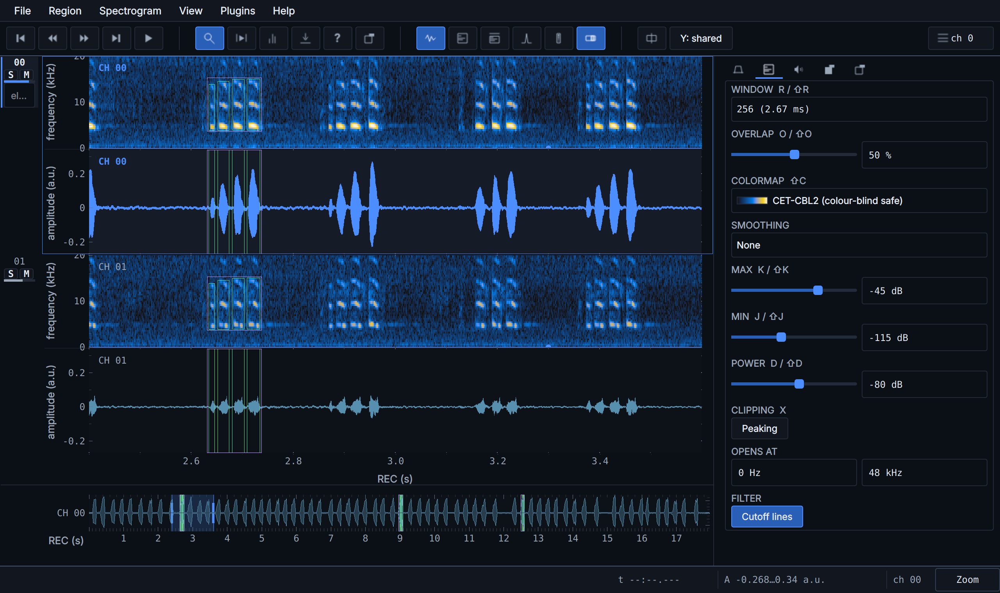
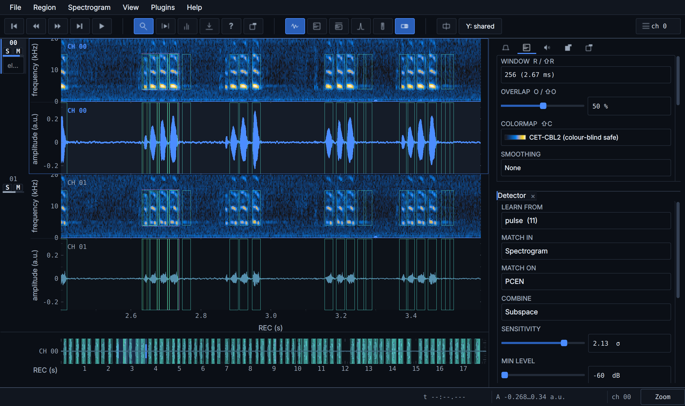
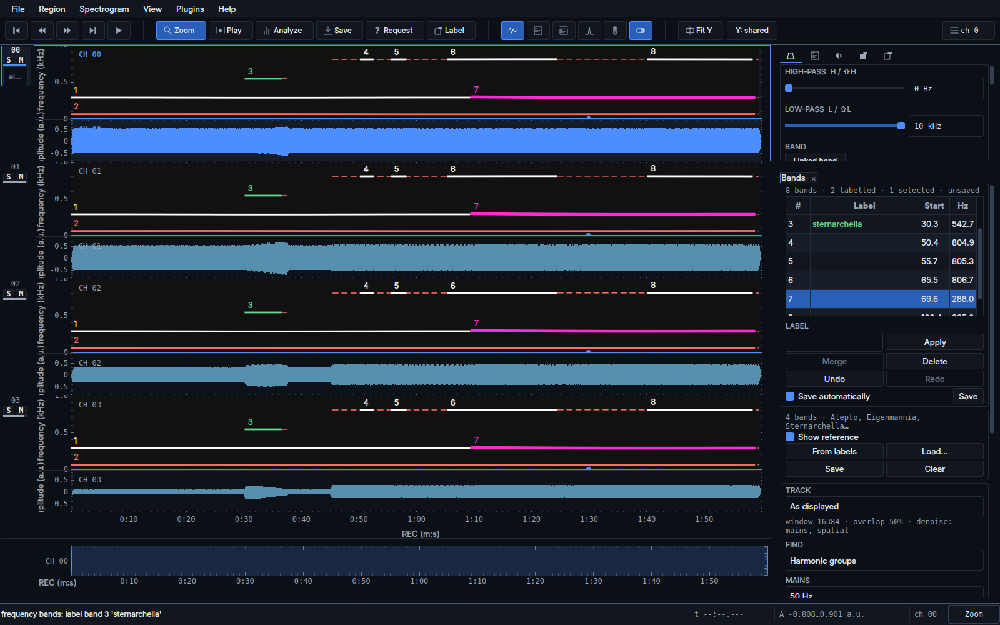
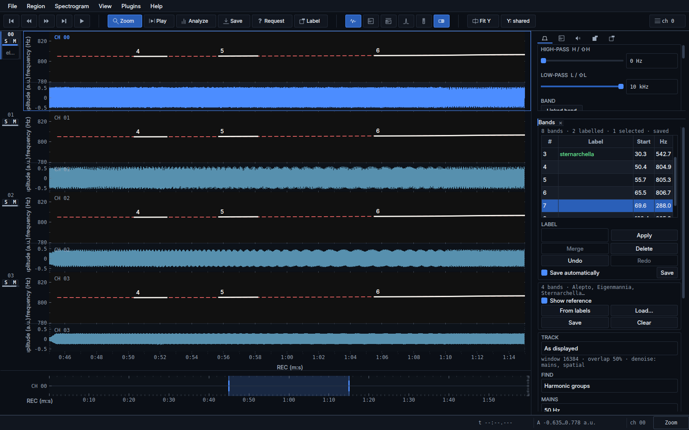
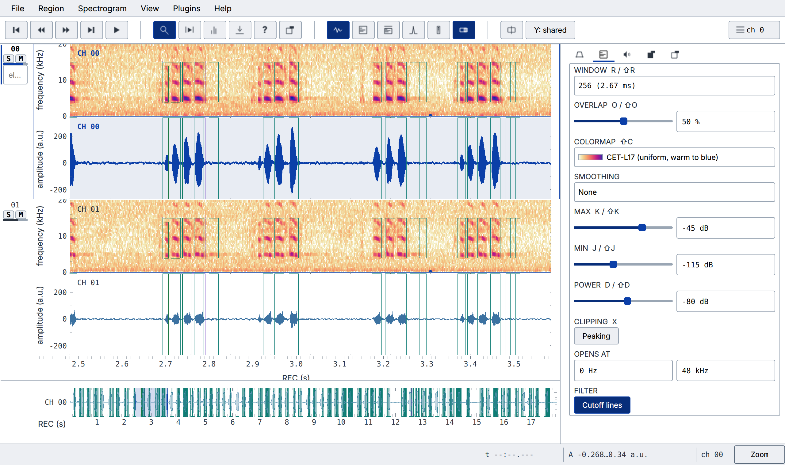

<div align="center">

# audian

**A fast, keyboard-driven viewer for recordings of animal vocalisations.**

Crickets, birds, bats, electric fish — single channel or a sixteen-electrode
array, a few seconds or a session split across a dozen files.

A fork of [bendalab/audian](https://github.com/bendalab/audian) by
[Jan Benda](https://github.com/janscience).

[](LICENSE)
[](pyproject.toml)
[](https://github.com/bendalab/audian)

</div>



## Install

Not on PyPI — `pip install audian` gets you
[the upstream release](https://pypi.python.org/pypi/audian/), not this fork.
Install this one from source:

```sh
git clone https://github.com/weygoldt/audian
cd audian
pip install -e .
```

## Use

```sh
audian recording.wav        # one file
audian session/*.wav        # a split session, joined by its timestamps
```

Press <kbd>Ctrl</kbd>+<kbd>K</kbd> for every shortcut, or <kbd>?</kbd> for the
cheat sheet. Almost everything has one.

## What it does

- **Long recordings, quickly.** Only the visible part is held in memory, so an
  hour-long multi-channel file opens as fast as a short one.
- **Traces, filters, envelopes, spectrograms** — per channel, in any
  combination, each panel hidden or shown with a key.
- **A spectrogram you can argue with.** Window length, overlap, colour map,
  level range, smoothing, and peaking to show where it clips — all live, all
  on the keyboard.
- **Band-pass filtering** with the cutoffs drawn on the spectrogram.
- **Two kinds of label, kept apart.** *Fixed* labels are what the instrument
  recorded; *editable* labels are your reading of it, drawn with the mouse
  into a CSV sidecar. audian never writes the first kind.
- **A navigator strip** showing the whole recording, so you always know where
  you are in it.
- **Plugins** for computed traces, analyses and side panels — including a
  few-shot event detector and a curator for tracked frequency bands, both of
  which ship with it.

## Detecting events

Mark a handful of examples, and let it find the rest.



**Plugins → Event detection → Normalised cross-correlation** learns templates
from the events you labelled and matches them against the recording, on the
spectrogram or on the waveform. Tune it on the window in front of you, then
run it over the whole file in the background. Results arrive as ordinary
editable labels — correct them, delete them, save them — and as a CSV beside
the recording.

The defaults were measured rather than guessed: which way of combining several
examples survives noise, why the threshold is relative to the noise floor
instead of an absolute score, and where the whole approach stops working. See
[`engine.py`](src/audian_plugins/eventdetection/engine.py) for the numbers.

## Curating tracked frequency bands

A tracker finds the bands. You fix the ones it got wrong.



**Plugins → Frequency bands** draws every tracked band over the spectrogram
and gives you the mouse to correct them. Click a band to select it, Ctrl+click
to add a second, right-click for a menu that acts on the band under the
cursor: split it there, merge it with what you have selected, label it, delete
it. Every one of those is undoable.

This is the job that cannot be automated away. A tracker fails in two
characteristic ways — it breaks one band in two where the frequency moved too
fast, and it swaps two identities where they crossed — and neither is fixable
by tracking harder. Both are obvious to a person looking at the picture.

**It tracks the spectrogram you are looking at.** Set the band-pass, choose a
window length, take the mains out with the denoisers — then track, and the
bands come from that picture rather than from a second one computed behind it.
In the visible window nothing is recomputed at all: the tracker reads the
block the lane drew. Over the whole file the same chain is reproduced, every
channel through the denoisers before one is picked, because the mains denoiser
tells a fish from the mains by comparing across the array. A line under the
control names the window, overlap, filter and denoisers the next run will
read, and it says so when the window is too coarse for the tolerance you asked
for — audian's default 256 puts 78 Hz in a bin, which cannot separate two fish
6 Hz apart.

Bands are found with **thunderfish's harmonic group finder** — the one
wavetracker itself uses. It groups a peak with its own multiples and reports
the *fundamental*, so a fish with four audible harmonics is one band rather
than four, and it sets the mains aside instead of tracking 50, 100 and 150 Hz
as three animals. On one channel of a 120 s four-channel test recording it
returns 6 bands where a plain peak finder returns 22: four fish, and two
places the tracker genuinely broke a band — which is the work you are here to
do. The fifth fish in that file sits 6 Hz from another and is not separated on
that channel, which is the crossing problem and not a threshold you can turn.
Run it over the visible window while you tune the settings, then over the
whole file on a background thread.

It needs `pip install audian[bands]`; without thunderfish the plugin falls
back to a plain peak finder and says so in the **Find** menu.

Or import a **wavetracker** output directory, which is the case this was
written for. That directory is opened **read-only**: your edits go to a
sidecar beside the recording, never back over the tracker's `.npy` files.

### Comparing against ground truth



Load a **reference** — what the recording is known to contain — and it is drawn
dashed underneath your own bands, in the same colour for the same label. Above,
the red dashed line is the true 806 Hz fish running the whole window; the solid
segments on top are what the tracker actually found, and the stretches where
the dashed line runs on alone are where it lost the animal. That is the whole
question a tracker raises, answered by looking.

A reference is an ordinary band file, so anything that can produce bands can
produce one. If your ground truth is stored as audian labels — the synthetic
recordings ship it as 323 chained one-second boxes, 120 of which are a single
Sternopygus — **From labels** reads them into tracks: boxes are grouped by
category and note, so a species plus an individual name is one animal, and a
hole longer than the labelling's own spacing ends a band rather than bridging
it. **Save** writes it beside the recording as `<stem>-truth-frequency-bands.csv`
so the conversion happens once. It is never edited and never written over your
own bands.

It replaces `wavetracker`'s `EODsorter`, and the differences are all about not
losing work. Merging keeps every vertex, where `EODsorter.connect` silently
discarded the detections two traces shared. Saving is atomic and beside the
recording, where `EODsorter.save` overwrote the tracker's only copy in place
with no backup. Band ids are never reused. An inconsistent set of input arrays
is reported rather than drawn as though it were true. See
[`bands.py`](src/audian_plugins/frequencybands/bands.py) for what is stored and
why it is two files.

## Two themes

Dark for a desk, daylight for a laptop in the field — high contrast, and a
colour map to match.

| Dark | Daylight |
| --- | --- |
|  |  |

```sh
audian --theme light recording.wav
```

## Writing a plugin

A plugin is a module exposing a callable named `audian_*panel`, `*analyzer` or
`*traces`. Bundled ones live in
[`src/audian_plugins/`](src/audian_plugins/); your own can sit in the
directory you launch from, or in its own installable package that declares:

```toml
[project.entry-points."audian.plugins"]
myplugin = "myplugin"
```

Import from [`audian.pluginapi`](src/audian/pluginapi.py) and nothing else —
that is the surface promised to keep working.

## Credits

audian is **Jan Benda's**, written in the
[Benda lab](https://github.com/bendalab) at the University of Tübingen. This
repository is a fork: the application, its data model and everything it knows
about reading recordings come from that work, and the great majority of the
commits behind it are his.

It stands on the lab's stack, all by the same authors:

| | |
| --- | --- |
| [audioio](https://github.com/bendalab/audioio) | reading and writing audio files and their metadata, on any platform |
| [thunderlab](https://github.com/bendalab/thunderlab) | multi-file loading, spectrograms, and the analysis routines under them |

Plus [pyqtgraph](https://pyqtgraph.readthedocs.io) for the plotting and
[PySide6](https://doc.qt.io/qtforpython/) for the window.

GPLv3, inherited from upstream.

## Notes

Documentation is out of date and being rewritten — `audian --help` and the
in-app cheat sheet (<kbd>?</kbd>) are current, the rest is not.
[`docs/architecture.md`](docs/architecture.md) describes how the code is put
together and lags it in places; `todo.md` is the working list.
