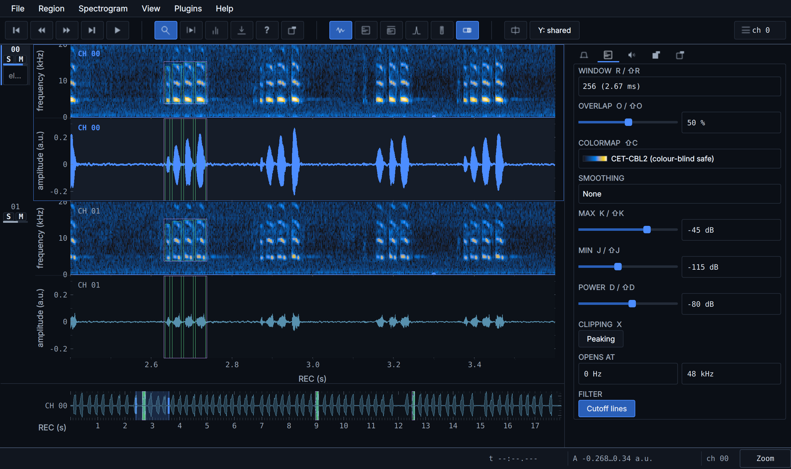
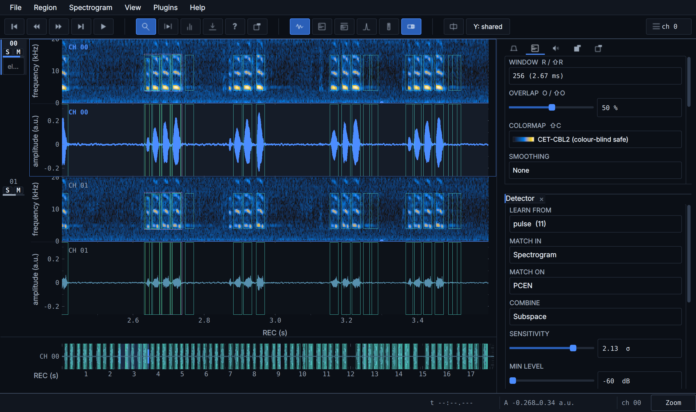
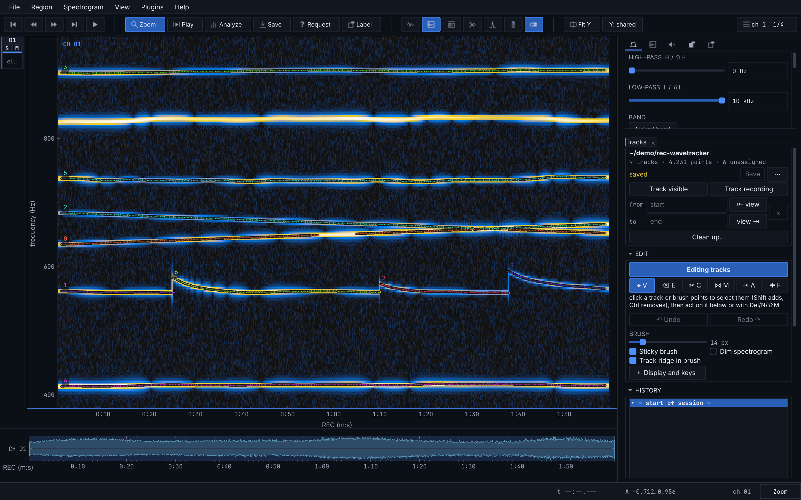
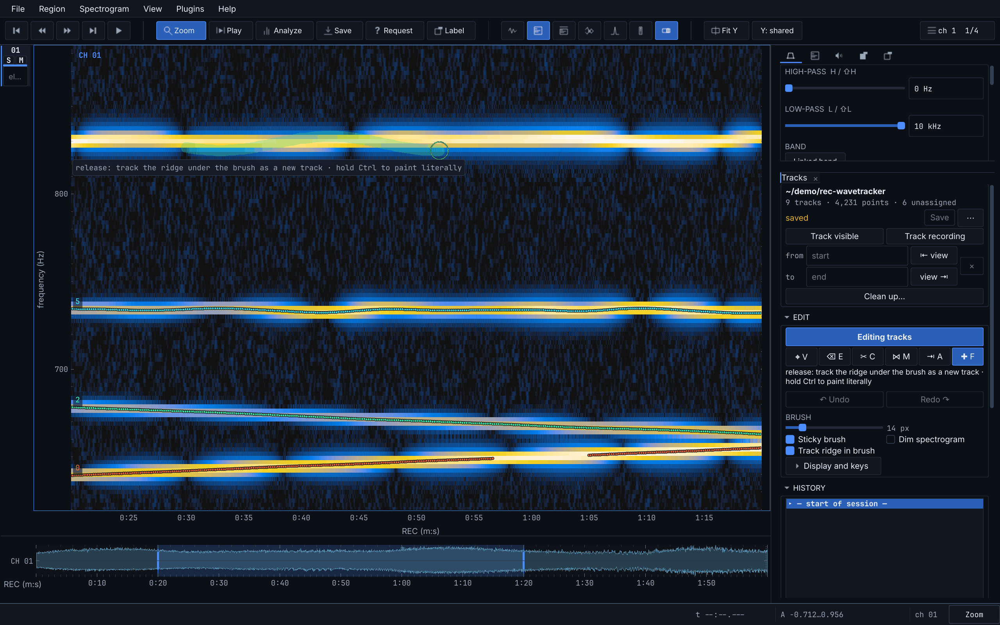
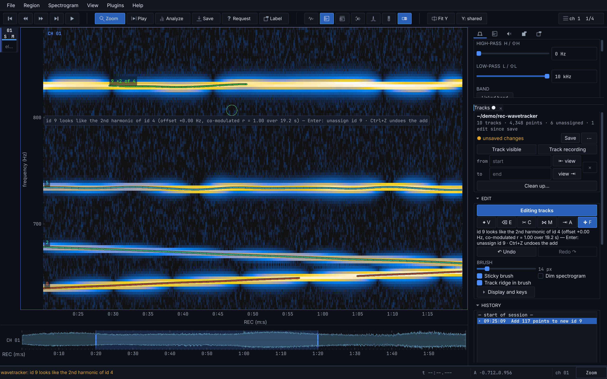
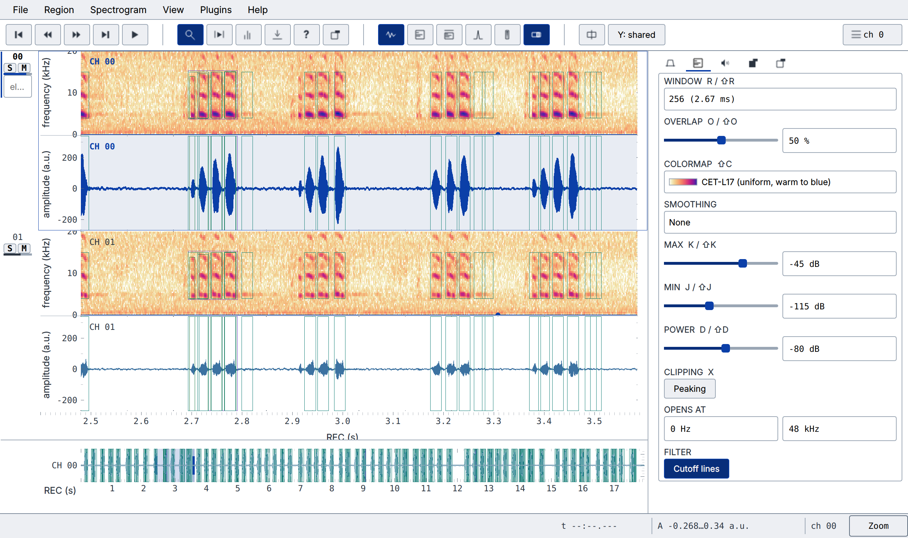

<div align="center">

# audian

**A fast, keyboard-driven viewer for recordings of animal vocalisations.**

Crickets, birds, bats, electric fish — single channel or a sixteen-electrode
array, a few seconds or a session split across a dozen files.

A fork of [bendalab/audian](https://github.com/bendalab/audian) by
[Jan Benda](https://github.com/janscience).

[](https://github.com/weygoldt/audian/actions/workflows/tests.yml?query=branch%3Amaster)
[](https://github.com/weygoldt/audian/actions/workflows/tests.yml?query=branch%3Amaster)
[](LICENSE)
[](pyproject.toml)
[](https://github.com/bendalab/audian)

</div>



## Install

Not on PyPI — `pip install audian` gets you
[the upstream release](https://pypi.python.org/pypi/audian/), not this fork.
Install this one from source. It runs on Python 3.11 to 3.14 (the range
[wavetracker](https://github.com/weygoldt/wavetracker), which it installs
alongside, supports); [uv](https://docs.astral.sh/uv/) fetches one if needed:

```sh
git clone https://github.com/weygoldt/audian
cd audian
uv sync
```

Without uv, in a Python 3.11–3.14 environment: wavetracker is not on PyPI, so
install it first, `pip install git+https://github.com/weygoldt/wavetracker`,
then `pip install -e .`.

## Use

```sh
audian recording.wav        # one file
audian session/*.wav        # a split session, joined by its timestamps
```

Press <kbd>Ctrl</kbd>+<kbd>K</kbd> for every shortcut, or <kbd>?</kbd> for the
cheat sheet. Almost everything has one.

## What it does

- **Long recordings, quickly.** Only the visible part is held in memory, so an
  hour-long multi-channel file opens as fast as a short one.
- **Traces, filters, envelopes, spectrograms** — per channel, in any
  combination, each panel hidden or shown with a key.
- **A spectrogram you can argue with.** Window length, overlap, colour map,
  level range, smoothing, and peaking to show where it clips — all live, all
  on the keyboard.
- **Band-pass filtering** with the cutoffs drawn on the spectrogram.
- **Two kinds of label, kept apart.** *Fixed* labels are what the instrument
  recorded; *editable* labels are your reading of it, drawn with the mouse
  into a CSV sidecar. audian never writes the first kind.
- **A navigator strip** showing the whole recording, so you always know where
  you are in it.
- **Plugins** for computed traces, analyses and side panels — including a
  few-shot event detector and a wavetracker front end for tracking and
  correcting electric fish, both of which ship with it.

## Detecting events

Mark a handful of examples, and let it find the rest.



**Plugins → Event detection → Normalised cross-correlation** learns templates
from the events you labelled and matches them against the recording, on the
spectrogram or on the waveform. Tune it on the window in front of you, then
run it over the whole file in the background. Results arrive as ordinary
editable labels — correct them, delete them, save them — and as a CSV beside
the recording.

The defaults were measured rather than guessed: which way of combining several
examples survives noise, why the threshold is relative to the noise floor
instead of an absolute score, and where the whole approach stops working. See
[`engine.py`](src/audian_plugins/eventdetection/engine.py) for the numbers.

## Tracking electric fish with wavetracker

**Plugins → Wavetracker** runs [wavetracker](https://github.com/weygoldt/wavetracker)
from inside audian and lets you correct what it got wrong, on the
spectrogram you are looking at. It replaces wavetracker's `EODsorter`.



*A synthetic recording, tracked with Track recording. One fish's rises have
broken it into four tracks (1, 6, 7, 8), and two fish cross near the end.*

| Add: brush along a line | …and audian says what you added |
| --- | --- |
|  |  |

*The ridge under the brush becomes a track. This one is the second harmonic
of fish 4, not a fish, so it is flagged; Enter unassigns it.*

- **Track visible** tracks the window in front of you in a few seconds and
  shows the result dashed over the session, to *Accept* or *Discard*.
  **Track recording** runs over the whole file (or split session) in the
  background. Or open an existing wavetracker output directory.
- **Track part of a recording**: the *Range* row (from / to, or *⇤ view* /
  *view ⇥*) limits Track recording to a stretch, marked on the spectrogram
  and remembered per recording; × goes back to the whole file.
- **Edit tracks** (<kbd>Ctrl</kbd>+<kbd>Shift</kbd>+<kbd>E</kbd>) gives the mouse
  six tools: Select <kbd>V</kbd>, Erase <kbd>E</kbd>, Cut <kbd>C</kbd>,
  Merge <kbd>M</kbd>, Assign <kbd>A</kbd>, Add <kbd>F</kbd>. Brushes paint
  their stroke as you drag, the track under the pointer is highlighted, and
  a box beside it says what the next click will do before you make it.
  The middle mouse button grabs the spectrogram and moves it.
- **Act on a selection** from the strip that appears under the tools while
  something is selected (Unassign, Unassign tracks, New id, Merge, Swap,
  Zoom, Clear; each also a key), or right-click the lane in edit mode.
- **Add tracks the ridge**: brush over a fish the tracker missed and the
  strongest continuous ridge of the raw spectrogram inside the brushed
  region becomes its detections, frames without one stay empty. Hold
  <kbd>Ctrl</kbd> while painting (or untick *Track ridge in brush*) to paint
  literally.
- **Harmonics are flagged**: an edit that makes a track at 2–5× another
  fish says so and labels it "×2 of 12"; <kbd>Enter</kbd> unassigns it.
- **Undo is a history**, not one step: <kbd>Ctrl</kbd>+<kbd>Z</kbd> /
  <kbd>Ctrl</kbd>+<kbd>Shift</kbd>+<kbd>Z</kbd>, or click any entry to go back
  to it. Edits are autosaved for crash recovery.
- **Saving never destroys the tracker's output**: the original identities are
  kept as `ident_v.tracked.npy`, the save is atomic, and the directory still
  loads with wavetracker's `Results.load`.

wavetracker is a dependency of this project: `uv sync` installs it into the
same environment as audian, so there is nothing to set up or point at. It
runs in a child process of that same Python, so a run never freezes the
window. To work on wavetracker
alongside, install your checkout over the locked one with
`uv pip install -e ../wavetracker`, or move the lock to its latest commit
with `uv lock --upgrade-package wavetracker`. The design, and the legacy
bugs it removes, are in [`docs/eodsorter-design.md`](docs/eodsorter-design.md).

## Two themes

Dark for a desk, daylight for a laptop in the field — high contrast, and a
colour map to match.

| Dark | Daylight |
| --- | --- |
|  |  |

```sh
audian --theme light recording.wav
```

## Writing a plugin

A plugin is a module exposing a callable named `audian_*panel`, `*analyzer` or
`*traces`. Bundled ones live in
[`src/audian_plugins/`](src/audian_plugins/); your own can sit in the
directory you launch from, or in its own installable package that declares:

```toml
[project.entry-points."audian.plugins"]
myplugin = "myplugin"
```

Import from [`audian.pluginapi`](src/audian/pluginapi.py) and nothing else —
that is the surface promised to keep working.

## Credits

audian is **Jan Benda's**, written in the
[Benda lab](https://github.com/bendalab) at the University of Tübingen. This
repository is a fork: the application, its data model and everything it knows
about reading recordings come from that work, and the great majority of the
commits behind it are his.

It stands on the lab's stack, all by the same authors:

| | |
| --- | --- |
| [audioio](https://github.com/bendalab/audioio) | reading and writing audio files and their metadata, on any platform |
| [thunderlab](https://github.com/bendalab/thunderlab) | multi-file loading, spectrograms, and the analysis routines under them |

Plus [pyqtgraph](https://pyqtgraph.readthedocs.io) for the plotting and
[PySide6](https://doc.qt.io/qtforpython/) for the window.

GPLv3, inherited from upstream.

## Notes

Documentation is out of date and being rewritten — `audian --help` and the
in-app cheat sheet (<kbd>?</kbd>) are current, the rest is not.
[`docs/architecture.md`](docs/architecture.md) describes how the code is put
together and lags it in places; `todo.md` is the working list.
